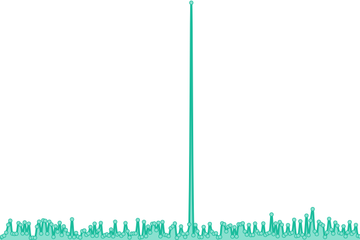

# [📈 Live Status](https://info-devf5r.github.io/VPN): <!--live status--> **🟧 Partial outage**

This repository contains the open-source uptime monitor and status page for [Abbas Al Khalifa](http://www.devf5r.com/), powered by [Upptime](https://github.com/upptime/upptime).

With [Upptime](https://devf5r.com), you can get your own unlimited and free uptime monitor and status page, powered entirely by a GitHub repository. We use [Issues](https://github.com/info-devf5r/VPN/issues) as incident reports, [Actions](https://github.com/info-devf5r/VPN/actions) as uptime monitors, and [Pages](https://info-devf5r.github.io/VPN) for the status page.

<!--start: status pages-->
<!-- This summary is generated by Upptime (https://github.com/upptime/upptime) -->
<!-- Do not edit this manually, your changes will be overwritten -->
<!-- prettier-ignore -->
| URL | Status | History | Response Time | Uptime |
| --- | ------ | ------- | ------------- | ------ |
|  [Official Website](https://devf5r.com) | 🟩 Up | [official-website.yml](https://github.com/info-devf5r/VPN/commits/HEAD/history/official-website.yml) | 

 445ms
     
 | 

<a href="https://info-devf5r.github.io/VPN/history/official-website">100.00%</a>
    

|  [alternative site](https://almgro7al3nzy.com) | 🟥 Down | [alternative-site.yml](https://github.com/info-devf5r/VPN/commits/HEAD/history/alternative-site.yml) | 

 544ms
     
 | 

<a href="https://info-devf5r.github.io/VPN/history/alternative-site">61.11%</a>
    

|  [API Website](http://api.devf5r.com) | 🟩 Up | [api-website.yml](https://github.com/info-devf5r/VPN/commits/HEAD/history/api-website.yml) | 

 982ms
     
 | 

<a href="https://info-devf5r.github.io/VPN/history/api-website">100.00%</a>
    

|  [Tik Tok](https://vt.tiktok.com/ZS8w6nu9M) | 🟩 Up | [tik-tok.yml](https://github.com/info-devf5r/VPN/commits/HEAD/history/tik-tok.yml) | 

 1544ms
     
 | 

<a href="https://info-devf5r.github.io/VPN/history/tik-tok">100.00%</a>
    

|  [CHAT Website](https://chat.devf5r.com) | 🟩 Up | [chat-website.yml](https://github.com/info-devf5r/VPN/commits/HEAD/history/chat-website.yml) | 

 401ms
     
 | 

<a href="https://info-devf5r.github.io/VPN/history/chat-website">100.00%</a>
    

|  [WhatsApp update](https://update.devf5r.com) | 🟩 Up | [whats-app-update.yml](https://github.com/info-devf5r/VPN/commits/HEAD/history/whats-app-update.yml) | 

 294ms
     
 | 

<a href="https://info-devf5r.github.io/VPN/history/whats-app-update">100.00%</a>
    

|  [slurred speech](https://kalam.devf5r.com) | 🟩 Up | [slurred-speech.yml](https://github.com/info-devf5r/VPN/commits/HEAD/history/slurred-speech.yml) | 

 276ms
     
 | 

<a href="https://info-devf5r.github.io/VPN/history/slurred-speech">100.00%</a>
    

|  [The spirit of feelings](https://quotes.devf5r.com) | 🟩 Up | [the-spirit-of-feelings.yml](https://github.com/info-devf5r/VPN/commits/HEAD/history/the-spirit-of-feelings.yml) | 

 314ms
     
 | 

<a href="https://info-devf5r.github.io/VPN/history/the-spirit-of-feelings">100.00%</a>
    

|  [upload files](https://up.devf5r.com) | 🟩 Up | [upload-files.yml](https://github.com/info-devf5r/VPN/commits/HEAD/history/upload-files.yml) | 

 333ms
     
 | 

<a href="https://info-devf5r.github.io/VPN/history/upload-files">100.00%</a>
    

|  [Private server net site 🇪🇺](https://vpn.devf5r.com) | 🟩 Up | [private-server-net-site.yml](https://github.com/info-devf5r/VPN/commits/HEAD/history/private-server-net-site.yml) | 

 281ms
     
 | 

<a href="https://info-devf5r.github.io/VPN/history/private-server-net-site">100.00%</a>
    

|  [سيرفر بريطانيا هويدي](uk.vpn.devf5r.com) | 🟥 Down | [syrfr-brytanya-hwydy.yml](https://github.com/info-devf5r/VPN/commits/HEAD/history/syrfr-brytanya-hwydy.yml) | 

 0ms
     
 | 

<a href="https://info-devf5r.github.io/VPN/history/syrfr-brytanya-hwydy">0.00%</a>
    

|  [سيرفر تركيا هويدي](tr.vpn.devf5r.com) | 🟥 Down | [syrfr-trkya-hwydy.yml](https://github.com/info-devf5r/VPN/commits/HEAD/history/syrfr-trkya-hwydy.yml) | 

 0ms
     
 | 

<a href="https://info-devf5r.github.io/VPN/history/syrfr-trkya-hwydy">0.00%</a>
    

|  [سيرفر فرنسا هويدي](fr.vpn.devf5r.com) | 🟥 Down | [syrfr-frnsa-hwydy.yml](https://github.com/info-devf5r/VPN/commits/HEAD/history/syrfr-frnsa-hwydy.yml) | 

 0ms
     
 | 

<a href="https://info-devf5r.github.io/VPN/history/syrfr-frnsa-hwydy">0.00%</a>
    

|  [سيرفر هولندا VPS](nlt-1.vpn.devf5r.com) | 🟥 Down | [syrfr-hwlnda-vps.yml](https://github.com/info-devf5r/VPN/commits/HEAD/history/syrfr-hwlnda-vps.yml) | 

 0ms
     
 | 

<a href="https://info-devf5r.github.io/VPN/history/syrfr-hwlnda-vps">0.00%</a>
    

|  [سيرفر المانيا  هويدي](de-1.vpn.devf5r.com) | 🟥 Down | [syrfr-almanya-hwydy.yml](https://github.com/info-devf5r/VPN/commits/HEAD/history/syrfr-almanya-hwydy.yml) | 

 0ms
     
 | 

<a href="https://info-devf5r.github.io/VPN/history/syrfr-almanya-hwydy">0.00%</a>
    

|  [سيرفر المانيا VPS](det-1.vpn.devf5r.com) | 🟥 Down | [syrfr-almanya-vps.yml](https://github.com/info-devf5r/VPN/commits/HEAD/history/syrfr-almanya-vps.yml) | 

 0ms
     
 | 

<a href="https://info-devf5r.github.io/VPN/history/syrfr-almanya-vps">0.00%</a>
    

|  [سيرفر بريطانيا VPS 2](ukt-2.vpn.devf5r.com) | 🟥 Down | [syrfr-brytanya-vps-2.yml](https://github.com/info-devf5r/VPN/commits/HEAD/history/syrfr-brytanya-vps-2.yml) | 

 0ms
     
 | 

<a href="https://info-devf5r.github.io/VPN/history/syrfr-brytanya-vps-2">0.00%</a>
    

|  [سيرفر بريطانيا VPS 2](38.48.123.89) | 🟥 Down | [syrfr-brytanya-vps-2.yml](https://github.com/info-devf5r/VPN/commits/HEAD/history/syrfr-brytanya-vps-2.yml) | 

 0ms
     
 | 

<a href="https://info-devf5r.github.io/VPN/history/syrfr-brytanya-vps-2">0.00%</a>
    

<!--end: status pages-->

[**Visit our status website →**](https://info-devf5r.github.io/VPN)

## 📄 License

- Powered by: [Upptime](https://github.com/upptime/upptime)
- Code: [MIT](./LICENSE) © [Abbas Al Khalifa](http://www.devf5r.com/)
- Data in the `./history` directory: [Open Database License](https://opendatacommons.org/licenses/odbl/1-0/)
